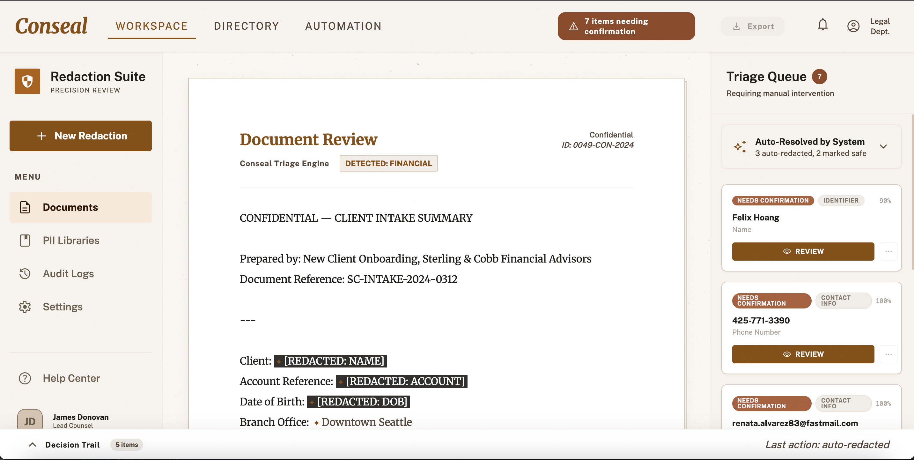
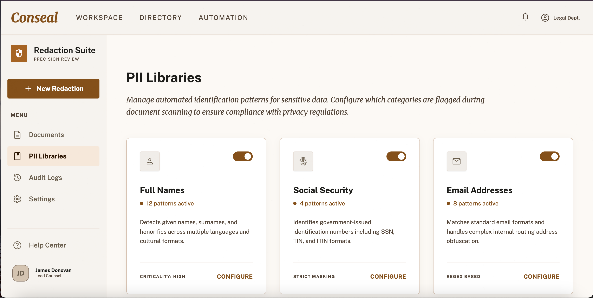
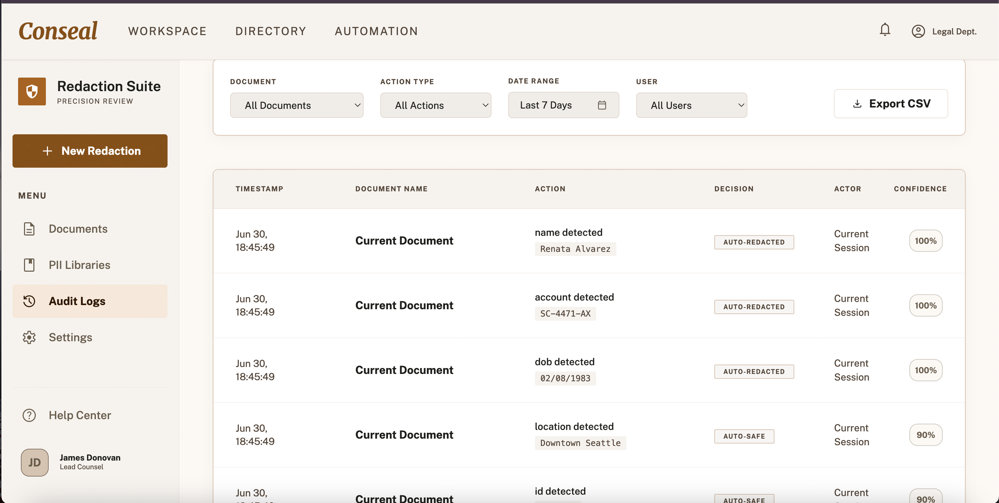
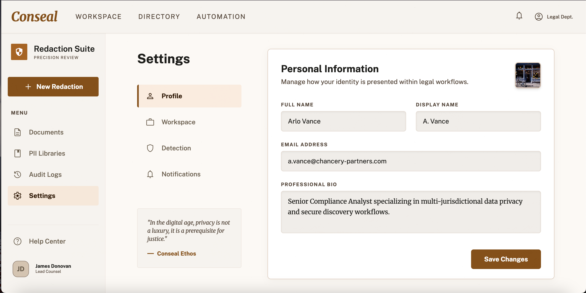

# Conseal

**[🚀 Live Demo](https://sprint-four-hack-keshav.vercel.app/)**
*(Want to test it out? **[⬇️ Download the Test Document](./test_document.txt)** to see the redaction engine in action!)*

Confidence Triage for PII redaction correction.

Conseal is a prototype tool for reviewing AI-suggested redactions in documents. It addresses a critical human factors issue: reviewers moving fast and overtrusting the machine. By implementing **asymmetric friction**, Conseal makes dangerous mistakes (missed PII) harder to miss than harmless ones (false positives).

## Architecture

*   **Frontend**: React (Vite), functional components, `useReducer` for state management, pure CSS for styling.
*   **Backend**: Node/Express serving a mock document and redaction data from a JSON file.

## Running Locally

1.  **Start the Backend**
    You must configure the Gemini API key before starting the server.
    ```bash
    cd server
    npm install
    echo "GEMINI_API_KEY=your_actual_key_here" > .env
    npm start
    ```
    The server will run on `http://localhost:3001`.

2.  **Start the Frontend**
    ```bash
    cd client
    npm install
    npm run dev
    ```
    The app will run on `http://localhost:5173`.

## Core Features

*   **Asymmetric Friction**: False positives can be dismissed with a single click. Missed PII (flagged as low confidence) requires an explicit confirmation step via a modal that cannot be easily dismissed.
*   **Risk-Ordered Queue**: Items are presented based on a risk score (`risk = (1 - confidence) * severityWeight`), ensuring high-risk items are reviewed first.
*   **Honest Exposure Meter**: A persistent counter reflecting the true remaining risk. It only shows an "All Clear" state when every high-risk item has been explicitly addressed.
*   **Decision Trail**: A lightweight log of decisions made during the session, allowing users to review and undo actions.

## Screenshots

Here is a look at the core interfaces and interactions within Conseal:

### Main Interface & Risk Queue

*The primary workspace where documents are reviewed. The Risk-Ordered Queue ensures that the most dangerous potential missed PII is surfaced first.*

### Asymmetric Friction in Action

*While false positives can be dismissed instantly, high-risk unredacted text forces a confirmation modal to prevent accidental rubber-stamping.*

### Honest Exposure Meter

*The system tracks remaining risk in real-time, refusing to show an "All Clear" until every high-risk item has been explicitly addressed.*

### Decision Trail

*A lightweight audit log tracks all actions taken during the session, allowing reviewers to easily undo mistakes.*

## Demo & Writeup

*   **[Demo Video](https://drive.google.com/drive/u/0/folders/11352ome6y4HdNSBGV_9x9K8H6O0wbuc6)**: A quick walkthrough of the application and the interaction model.
*   **[Full Writeup](./WRITEUP.md)**: Detailed explanation of the design decisions, architecture, and what was intentionally omitted.
